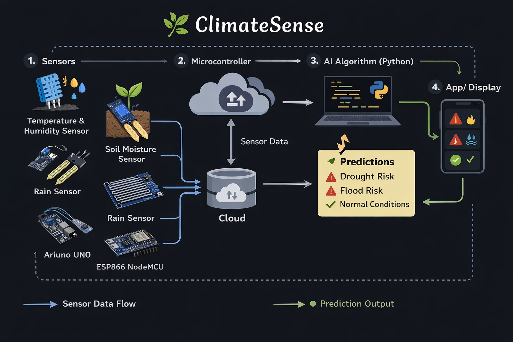

# 🌿 ClimateSense

# 🌍 Environment and Sustainability in the AI Era

## 📌 Problem Statement
**Gramin-Mind: Hyper Local Intelligence for Climate Resilience**  
Small villages often lack access to accurate micro-level climate data, making it difficult to anticipate rainfall, floods, or droughts. Gramin-Mind provides hyperlocal climate intelligence to help communities respond.

---

## 💡 Solution
ClimateSense collects real-time environmental data using sensors 
and predicts climate risks using AI models.

The system alerts farmers about:
- 🌊 Flood Risk
- 🌵 Drought Risk
- 🌧 Heavy Rain
- 🌱 Crop Stress

---

## 🏗 System Architecture
Sensors → ESP32 → AI Model → GSM/WiFi → Farmer Alerts

---

## ⚙️ Tech Stack
- Embedded C (Arduino)
- Python (Machine Learning)
- ESP32 / Arduino
- DHT11 Sensor
- Soil Moisture Sensor
- GSM Module

---
## 🏗 System Architecture

## 📂 Project Structure
# 🌍 ClimateSense

## 📌 Problem Statement
Climate changes are difficult to monitor and predict accurately.

## 💡 Solution
ClimateSense predicts and analyzes climate patterns using machine learning.

## ⚙️ Tech Stack
- Python
- NumPy
- Pandas
- Matplotlib
- Machine Learning

## 🚀 How to Run
1. Install requirements
2. Run app.py

## 👩‍💻 Team – Signal Sentries
1. Nitya Priya L  
2. Sushma P  
3. Jananie Pritha J
